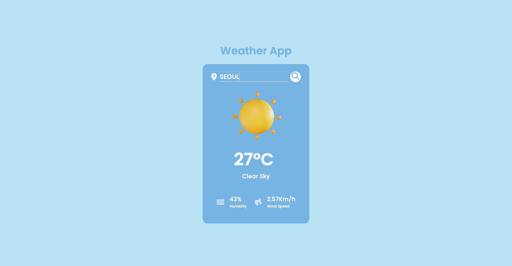

# weather

> 도시별로 날씨를 검색할 수 있는 웹 사이트입니다.

영어로 도시를 검색하여,
해당되는 도시의 온도, 습도, 풍속, 등 날씨 정보를 알 수 있습니다.

### demo

[https://sorate7624.github.io/weather/](https://sorate7624.github.io/weather/)



## 설치 방법

아래 단계를 따라 프로젝트를 설치하세요.

1. 프로젝트를 클론합니다.

   ```bash
   git clone https://github.com/sorate7624/weather.git
   ```

2. 프로젝트 디렉토리로 이동합니다.

   ```bash
   cd weather
   ```

3. 종속성을 설치합니다.

   ```bash
   npm install
   ```

4. 프로젝트를 실행합니다.
   ```bash
   npm run dev
   ```

## 기술 스택

프로젝트의 기술 스택은 다음과 같습니다.

### Development

<div style="display: flex">
  
  
  
  <br/>
  
  
</div>

### Environment

<div style="display: flex">
  
  
  
</div>

### Config

<div style="display: flex">
  
</div>

## 폴더 구조

프로젝트의 주요 폴더 구조는 다음과 같습니다.

- `public/`: 정적 파일들을 담고 있는 폴더입니다. 'Earth' 이미지 관련 파일이 여기에 위치합니다.
- `src/`: 프로젝트의 소스 코드를 담고 있는 폴더입니다. `main.jsx` 파일이 여기에 위치합니다.
  - `api/`: 프로젝트에서 사용되는 api 관련 파일들을 담고 있는 폴더입니다.
  - `assets/`: 프로젝트에서 사용되는 resouces들을 담고 있는 폴더입니다.
  - `weather.styles.ts`: 프로젝트에서 사용되는 styled-components 파일입니다.
- `tsconfig.json`: typescript 설정 파일입니다.

## 업데이트 내역

- 0.0.2
  - 모바일 UI 적용
- 0.0.1
  - 첫 출시

## 정보

최혜진 – sorate_@naver.com

[https://github.com/sorate7624/](https://github.com/sorate7624/)

## 기여 방법

1. (<https://github.com/sorate7624/weather/fork>)을 포크합니다.
2. (`git checkout -b feature/fooBar`) 명령어로 새 브랜치를 만드세요.
3. (`git commit -am 'Add some fooBar'`) 명령어로 커밋하세요.
4. (`git push origin feature/fooBar`) 명령어로 브랜치에 푸시하세요.
5. 풀리퀘스트를 보내주세요.
